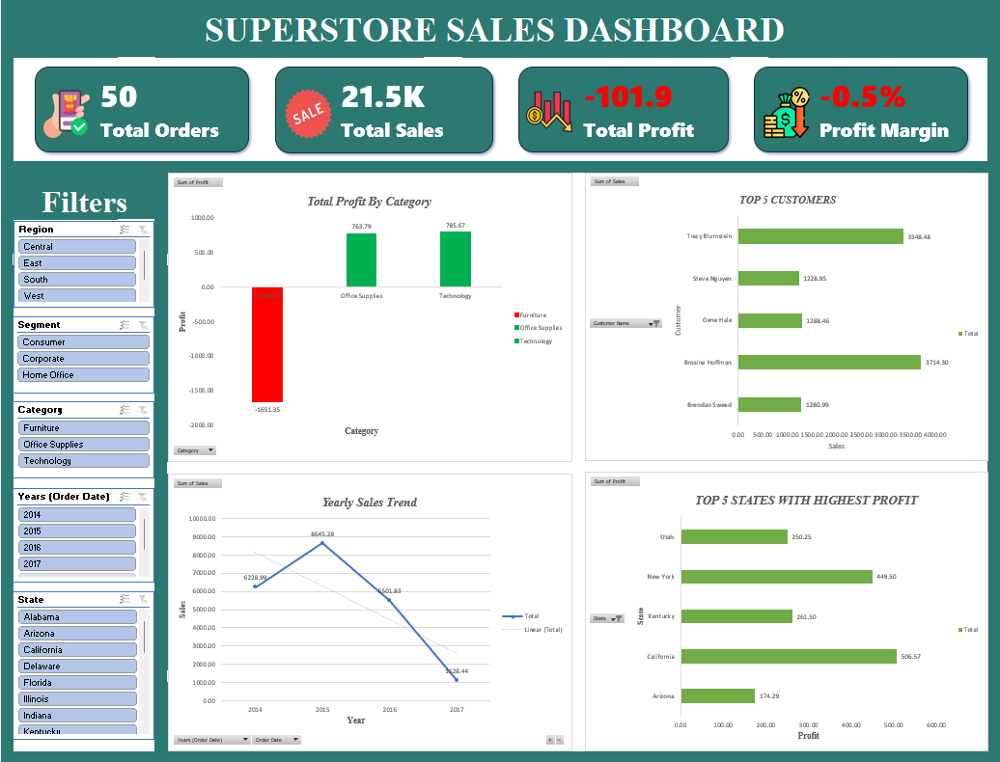

# 🛒 Superstore Sales Dashboard

## 🔍 Project Overview

This project analyzes retail sales data from a superstore to evaluate business performance, profitability, and customer behavior. The dashboard provides insights into sales trends, product performance, and regional profitability.

---

## 🎯 Objective

The objective of this project is to identify key factors affecting profitability, analyze customer and regional performance, and uncover opportunities to improve business outcomes.

---

## 📌 Key Insights

* The business recorded a **negative total profit (-101.9)** despite generating sales, indicating profitability issues.
* The **overall profit margin is negative (-0.5%)**, showing that costs and discounts are impacting earnings.
* The **Furniture category is operating at a loss**, while Office Supplies and Technology generate positive profit.
* Sales show a **declining trend over the years**, indicating reduced business performance.
* A small group of customers contributes significantly to total sales, highlighting **high-value customers**.
* Certain states such as **California and New York generate the highest profits**, indicating strong regional performance.

---

## 📊 Dashboard Features

* KPI Cards (Total Sales, Total Profit, Profit Margin, Total Orders)
* Profit by Category Analysis
* Top Customers by Sales
* Yearly Sales Trend
* Top States by Profit
* Interactive Filters (Region, Segment, Category, Year, State)

---

## 🛠️ Tools & Technologies

* **Excel** – Data cleaning, Pivot Tables, KPI Cards, Dashboard Design

---

## 📁 Dataset Description

The dataset contains retail transaction data with key fields such as:

* Customer Information
* Product Categories and Sub-categories
* Sales, Profit, and Discount Data
* Order Date and Region
* Geographic Information (State, Region)

---

## 🚀 Key Skills Demonstrated

* Data Cleaning and Preparation in Excel
* Pivot Table Analysis
* KPI Development and Business Metrics Tracking
* Profitability Analysis
* Dashboard Design and Visualization
* Insight Generation from Sales Data

---

## 📷 Dashboard Preview

---

## 📌 Conclusion

This dashboard highlights critical profitability challenges within the business, particularly in specific product categories. It provides actionable insights that can help improve pricing strategies, reduce losses, and enhance overall business performance.

---

